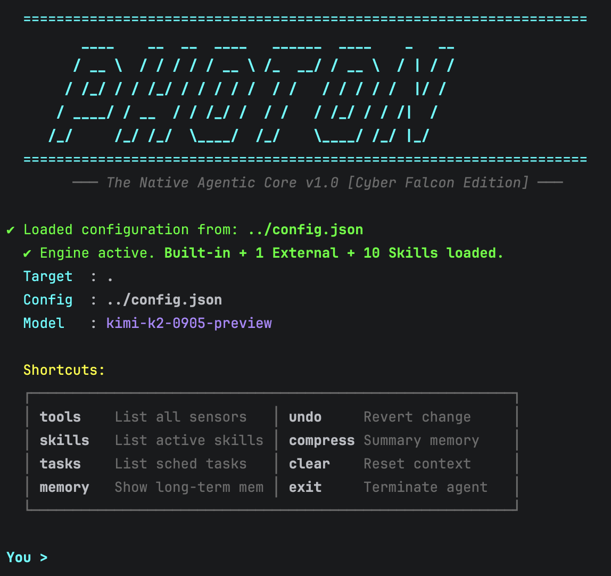

# <p align="center">⚛️ PHOTON: THE NATIVE AGENTIC CORE</p>

<p align="center">
  <b>作者:</b> hearn (<a href="mailto:hearn.qk@gmail.com">hearn.qk@gmail.com</a>)
</p>

<p align="center">
  
  
  
  
  
</p>

<p align="center">
  <a href="README.md">中文</a> | <a href="README.en.md">English</a> | <a href="README.jp.md">日本語</a>
</p>

<p align="center">
  <b>"Reasoning through light, coding through logic."</b><br>
  Photonは単なるAIアシスタントではありません。C++で構築された<b>高性能・エンジニアリング級の自己進化型エージェントコア</b>です。<br>
  AIに真の「手」と「脳」を与え、マイクロ秒単位の応答速度、深い推論能力、多次元の知覚システムを通じて、<br>
  <b>AI駆動のソフトウェア開発パラダイムを根本から再定義します。</b>
</p>

<p align="center">
  
</p>

---

## 📦 クイックスタート [Quick Start]

1.  **ダウンロード**: [Releases](https://github.com/QkHearn/Photon/releases)からバイナリを取得します。
2.  **設定**: `config.json`でAPI Keyとモデルパラメータを設定します。
3.  **起動**:
    ```bash
    ./photon <your_project_path>
    ```

---

## 🌟 コアエボリューション [Core Evolutions]

### 🧠 深い認知的推論 (Cognitive Reasoning)
Photonは「直感的な応答」を拒否します。複雑なエンジニアリングの課題に対し、自動的に内部の**思考キャンバス (Sequential Thinking)**を展開し、多段階の仮説構築、論理推論、戦略の修正を行います。熟練したエンジニアのように「脳内」で案を練り上げ、すべての実行がエンジニアリング級の厳密さと実現可能性を備えるようにします。

### 🏎️ 極限のネイティブ性能 (Native Velocity)
インタープリタ言語の鈍重さに別れを告げましょう。**C++17**に基づき純粋に構築されたPhotonのツールチェーン呼び出しは、**マイクロ秒単位**の応答速度を実現します：
*   **ゼロ秒起動**: バイナリプログラムは瞬時に戦闘状態に入ります。
*   **並列スキャン**: 従来のIDEよりも高速なコンテンツ特定能力を持ち、ミリ秒単位で数万行のコードベースをスキャンし、コンテキストを正確に特定します。

### 🧩 モジュール式スキルシステム (Skill Modules)
Photonは先進的な**Skillモジュール化アーキテクチャ**を導入しました。単なるツールの集まりではなく、**能力のプラグイン化**を実現しています。
*   **Skill Manager**: 専門分野の知識パッケージ（`skill-creator`など）を動的にロードし、汎用AIを一瞬で特定の分野のスペシャリストに変貌させます。
*   **ローカライズ同期**: グローバルなスキルをプロジェクトのローカルディレクトリに自動的に同期し、プロジェクト単位の能力のカスタマイズと隔離をサポートします。

### 👁️ 多次元アーキテクチャ知覚 (Architecture Perception)
Photonはテキストを超えた知覚能力を持っています。**AST分析**を通じて複雑なプロジェクトの骨格を一瞬で分解するだけでなく、**Graphviz**を利用して抽象的なコードロジックをリアルタイムで**可視化アーキテクチャ図**としてレンダリングし、システムの構造を一目で把握できるようにします。

### 🕸️ 無限の境界拡張 (Universal MCP)
標準の **Model Context Protocol (MCP)** を通じて、Photonは現代のエコシステム全体と接続します：
*   **ブラウザの覇権**: Puppeteerを完璧に統合し、AIにChromeを直接制御する能力を与えます（ドキュメントの参照、ウェブページのデバッグ、フルオートメーションフロー）。
*   **デュアルドメイン演算**: C++の安定した実行とPython Sandboxの柔軟な演算を組み合わせ、あらゆるシナリオのニーズをカバーします。

---

## 🏗️ システムアーキテクチャ [Architecture]

```text
       ┌──────────────────────┐
       │   User Terminal UI   │  (Rich ANSI / Markdown Rendering)
       └──────────┬───────────┘
                  │ 
       ┌──────────┴───────────┐
       │   Photon Core (C++)  │─── [ Context Manager ]
       └─────┬──────────┬─────┘    (Memory & Adaptive Compression)
             │          │
    ┌────────┴──┐  ┌────┴─────────────────────────────┐
    │LLM Client │  │         MCP Tool Manager         │
    └─────┬─────┘  └────┬────────────┬────────────────┤
    │             │            │                │
    [ API Gateway ]  [Built-in]   [External]       [Skills]
    (OpenAI / Kimi)  (C++ Native) (Node / Python)  (Modular Caps)
```

---

## 🔬 エージェントの兵器庫 [The Arsenal]

Photonには**20以上**の重厚なエンジニアリングツールがプリインストールされており、完全な知覚・意思決定・実行のループを形成しています：

### 📂 ホログラフィックなファイル知覚
*   **file_search / grep_search**: Git優先の並列検索により、コードスニペットを正確に特定します。
*   **read_file_lines**: インテリジェントなスライス読み込みにより、Tokenウィンドウを保護しながら詳細な情報を取得します。
*   **code_ast_analyze**: 骨格知覚により、Tokenを消費せずにプロジェクト全体の構造を理解します。

### 🛠️ 原子レベルのリファクタリングと実行
*   **diff_apply**: 決定論的なコード注入により、リファクタリングプロセスでの冗長性をゼロにします。
*   **python_sandbox**: `.venv`環境を自動的に識別し、依存関係の即時インストールと演算の実行をサポートします。
*   **arch_visualize**: コードロジックをワンクリックでアーキテクチャ図に変換します。
*   **skill_read**: スキルガイドを動的に読み込み、必要に応じて専門知識をロードします。

### 🌍 グローバルな知識検索
*   **web_search / web_fetch**: 情報収集を自動化し、AIに最も純粋なリアルタイムのコーパスを提供します。
*   **harmony_search**: HarmonyOS開発者エコシステムと深く統合し、HarmonyOSコアドキュメントを秒速で特定します。

### 💾 会話をまたぐ永続メモリ
*   **memory_management**: プロジェクトの規約や過去の教訓を記録します。Photonは使用するにつれて、あなたの習慣をより理解するようになります。

---

## 🛡️ 防御プロトコル [Photon Guard]

**Photon Guard**はすべての低レベルの呼び出しをリアルタイムで監視し、エージェントが安全な境界内で動作することを保証します：
*   **パスのロック**: パスのエスケープを厳禁し、権限を現在のワークスペース内に厳格に制限します。
*   **危険の検知**: `rm -rf`や`sudo`などの破壊的なコマンドをリアルタイムで遮断します。
*   **隔離実行**: 機密性の高いシステム操作を強制的にインターセプトします。

---

<p align="center">
  <i>"Photon is the bridge between human intent and machine logic."</i>
</p>
